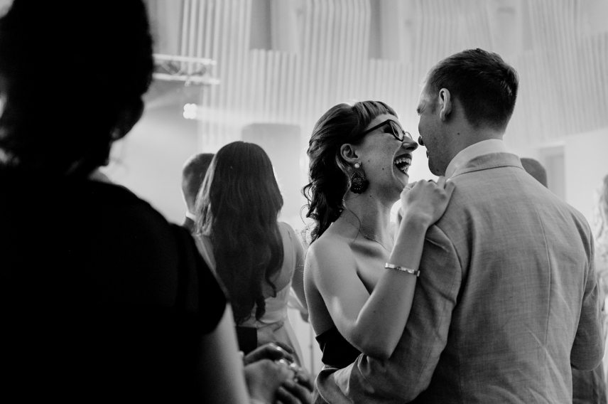

<h1>Kościół</h1>

    <a href="https://goo.gl/maps/aEmMT7dcigrc1UDn7" target="_blank">
<b>Kościół Wniebowstąpienia Pańskiego, ul. Atolowa 6, Osowa Góra, 85-435 Bydgoszcz.</b>
</a>

Kościół Wniebostąpienia Pańskiego znajduję się na Osowej Górze, około 15 minut jazdy od centum. Jeśli planujecie przyjechać samochodem, przy kościele znajduje się parking. Jeśli nie, zapewnimy transport z centrum miasta.

Ceremonia w kościele zacznie się o 17.00. Jeśli planujecie zatrymać się w centrum Bydgoszczy i skorzystać z transportu do kościoła, skontaktujemy się ze wszystkimi, aby ustalić czas i miejce na spotkanie.

Jak wiecie, nasz ślub bęzdzie międzynarodowy! Część gości przyleci z Wielkiej Brytanii, dlatego, pomimo, że sama ceremonia i wesele odbędzie się głównie w języku polskim, to na miejscu będzie również konferansjer, który na bieżąco wytłumaczy po angielsku przebieg ślubu.

