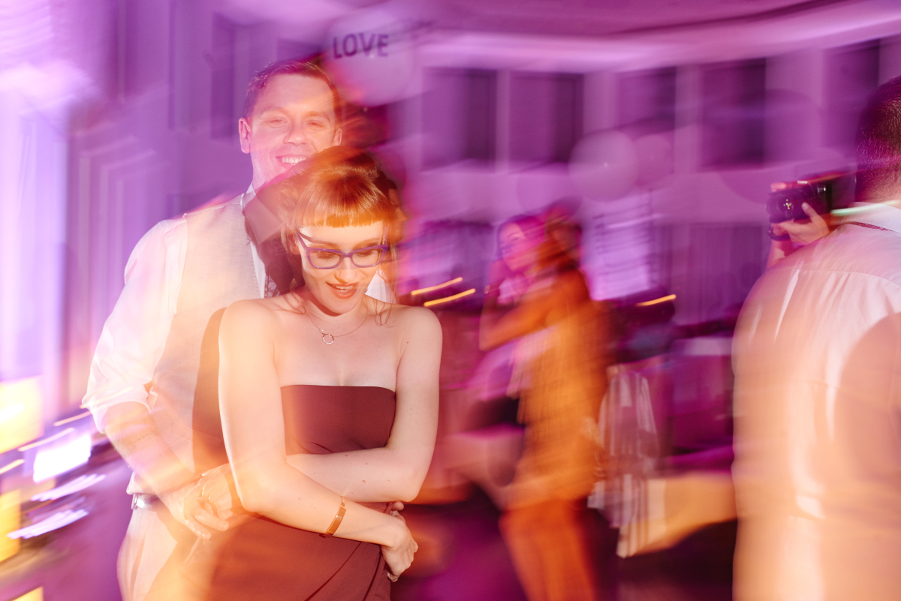

<h1>The Party</h1>

    <a href="https://goo.gl/maps/8egdG9CUiV9P2hH39" target="_blank">
<b>Dwór Hulanka, Pawłówek 6, 85-438 Bydgoszcz.</b>
</a>

You'll be drinking lots of Vodka, start preparing your body. A Polish wedding party is quite different to an English wedding.

The party starts immediately after the wedding ceremony, transport to the venue will be available.

<b>Room at the venue are very limited and <u>reserved for close family or those who need to look after young children</u>. If you would like to put your name down for a room at the party venue please contact us to chat. However, the venue is only a short 15 minute ride back to the city. We'll be making sure everybody gets back to their hotel safely.</b>

To summarise the actual party - it basically comes in waves. You'll be fed, we'll drink some vodka, then we'll dance. After a short while, more food will come and we repeat until sunrise. Yes, a Polish wedding usually goes on till the early hours. The steady intake of food and mandatory dancing should be enough to keep you sober. The tradition is to do a shot at various times throughout the evening, so <em>pace yourself</em>.

There is no bar, the alcohol is provided by us. So if you drink everythin on your table within 20 minutes you'll be getting a hangover by the end of the night. I know us Brits take wedding parties as a personal challenge, but the aim is to be still going strong by 4am so be sensible

Throughout the night there will be various activities and games, there is a DJ and a translator - they're both experienced in doing Polish/English wedding parties, so everything will be made clear. But you will be encouraged to do some mingling with people you don't understand, so we'll provide some useful phrases to learn down below.

